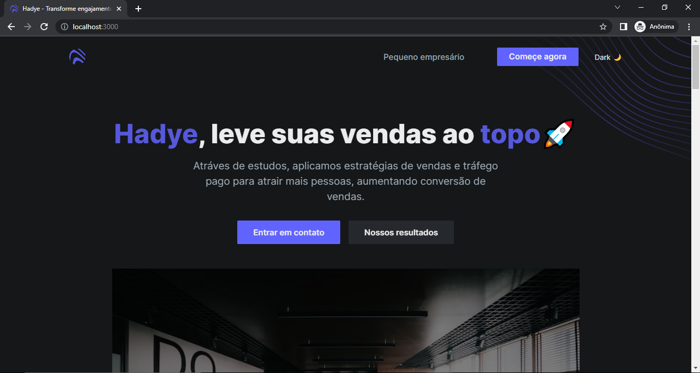

<h1 align="center">🚀 Hadye 🔥 </h1>

Landing page para uma startup fictícia de gestão de vendas.

 <a href="#sobre">Sobre</a> •
 <a href="#aprendizados">Aprendizados</a> •
 <a href="#tecnologias">Tecnologias</a> •
 <a href="#instalacao">Instalação</a>

  <h1>📎 Sobre. </h1>
  

      O Hadye surgiu como uma ideia para aplicar os conhecimentos da biblioteca tailwindcss, mas se tornou um projeto amplo, na qual consumiu recursos nativos 
      da linguagem javascript e do framework react através de animações ao scroll feita sem o auxílio de bibliotecas externas. Todo o código do layout foi desenvolvido por 
      mim, mas o template foi retirado do repositório <a href="https://github.com/cruip/open-react-template" target="_blank">open-react-template</a>. O layout foi recriado utilizando o figma, clique <a href="https://www.figma.com/file/RRctAQ7HQ0WU12r41oL6Vy/hadye?node-id=0%3A1">aqui</a> para visualizar.
  

  

      Para ver o resultado final basta acessar: <a href="https://hadye.vercel.app/" target="_blank">Hadye online 🚀</a>.
  

  

 <h1>📚 Aprendizados. </h1>
 
Como dito na introdução, o projeto utilizou recursos nativos da linguagem e do farmework, como custom hooks, useRef, eventos, setTimeOut etc..., para realizar animações ao rolar o scroll, se tornando um ótimo momento para recordar conceitos básicos.

 <ul>
  <li>Criação de hooks.</li>
  <li>Árvore de eventos do DOM.</li>
  <li>Classes utilitárias do tailwindcss.</li>
  <li>Técnicas de reutilização de estilos com o tailwindcss.</li>
  <li>Tema dark & light.</li>
  <li>Responsividade.</li>
  <li>Boas práticas com tailwindcss.</li>
 </ul>

  <h1>🛠 Tecnologias.</h1>
  

    
    
    
    
    

   <h1>ℹ️ Instalação.</h1>
  <ul>
    <li>
      
Clone o projeto e acesse a pasta do mesmo.

      <code>
          $ git clone https://github.com/souzzs/hadye.git
      </code>
    </li>
    <li>
      
Instale as dependências

      <code>
          $ npm install
      </code>
    </li>
    <li>
      
Inicie o projeto

      <code>
          $ npm run dev
      </code>
    </li>
  </ul>

  <h1>✏️ Autor.</h1>
  
Desenvolvimento por <a href="https://github.com/souzzs">Caio Souza</a>.

  

    
    
    
  

